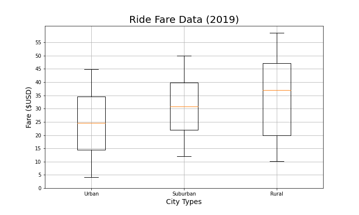
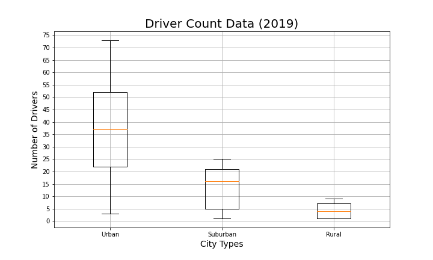
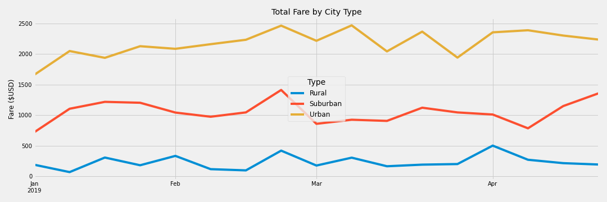

# PyBer_Analysis

## Overview
Analyze all ride share data from a company, PyBer, from January to May of 2019 and create graphs to show the trends and relationships between city locations, number of drivers, and fares.

## Results
Urban cities have the largest market share for this company. Although the average fare per ride is smaller than the other locations, suburban and rural, the higher volume of rides makes up for it. Rural areas bring in the lowest revenue despite having the higest average fare. 

 

The average fare for rural areas was significantly higher than urban and suburban areas.

Urban areas have the highest volume of rides and the most drivers.

These two factors contributed to urban areas having the highest earnings from fares for the specified time frame. 

## Summary
Because there are so few drivers in rural areas, it could be that scarcity is bringing up the average fare. Drivers are harder to find, and must go father distances to find riders and thus have to charge more. Consequently riders see these high fares and decide on alternate modes of transportation. One solution could be a marketing campagin to hire more drivers in rural areas in order to decrease the average fare and attract more riders. Alternatively, it may be worth considering a cap on the total number of drivers in urban areas. If the average fare dips too low it may not cover operating costs. 
